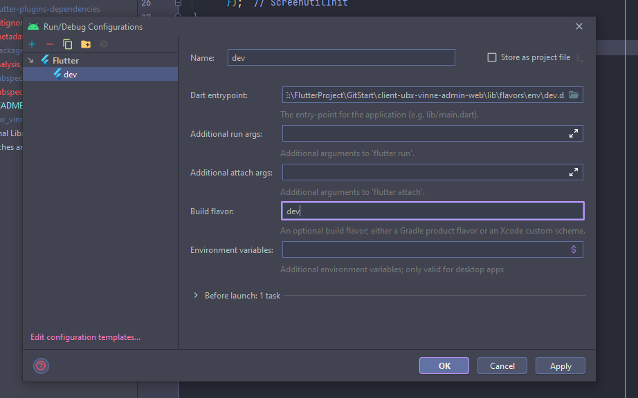

# Food Delivery App (YouTube)

A new Flutter project.

# Important Information
### Required Flutter Version
```yaml
    flutter version: 2.10.5 or above
```
## Steps to run
### Step 1: Run this below command on your terminal (Must be ran on your project root dir)
```yaml
flutter clean && flutter pub get && flutter pub run build_runner build --delete-conflicting-outputs
```
### Step 2: Use this command according to Enviroment (Must be ran on your project root dir)
```yaml
flutter run -d chrome -t lib/flavors/env/dev.dart
```
### Environments

There are 3 environment configurations:

1. Staging
2. Production
3. Development

#### Development

```
flutter run -d chrome -t lib/flavors/env/dev.dart
```

#### Staging

```
flutter run -d chrome -t lib/flavors/env/staging.dart
```

#### Production

```
flutter run -d chrome -t lib/flavors/env/prod.dart
```

## Freezed Model Generation

```
flutter clean && flutter pub get && flutter pub run build_runner build --delete-conflicting-outputs
```

## Setup Android Studio Configuration (Optional)



### Tech Stack
1. Flutter BLOC with Cubit
2. Dio with Retrofit
3. Freezed Model using Build Runner


